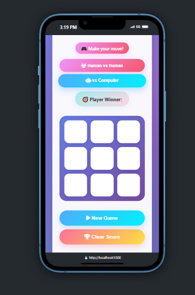
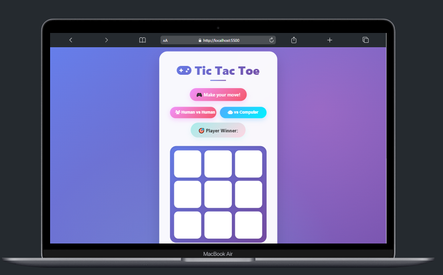

# 🎮 Trò Chơi Tic-Tac-Toe (X/O) Với AI Minimax

<i>@Author: <b>Vinhdev04</b></i>

<hr>

Đây là **trò chơi Tic-Tac-Toe (Caro 3x3)** được xây dựng bằng HTML, CSS và JavaScript.  
Người chơi có thể thi đấu **1 vs 1** hoặc **chơi với máy (AI)**.  
AI sử dụng thuật toán **Minimax** để đưa ra nước đi tối ưu, đảm bảo chơi "thông minh" và khó bị đánh bại.

Dự án có **lưu điểm thắng/thua/hòa** bằng `localStorage` và **giao diện hiện đại, responsive**.

---

## 📌 Tính Năng

- 🎯 **2 chế độ chơi**: Người vs Người, Người vs AI
- 🧠 AI sử dụng thuật toán **Minimax** để tính toán nước đi tối ưu
- 🔄 **Lưu điểm số** (X, O, Hòa) vào `localStorage`
- 💾 Có nút **Xóa điểm** để reset bảng điểm
- 🎨 UI đẹp, responsive, hỗ trợ cả desktop và mobile
- ✨ Highlight khi AI đang suy nghĩ
- ⏳ AI suy nghĩ có độ trễ giả lập để tăng tính chân thật
- 🔍 Tự động kiểm tra thắng/hòa sau mỗi lượt đi

---

## 🛠️ Công Nghệ Sử Dụng

- HTML5
- CSS3 (Flexbox, Responsive Design, Animation)
- JavaScript (ES6+)
- LocalStorage API

---

## 🚀 Xem Trực Tiếp

👉 [Xem demo tại đây](https://vinhdev04.github.io/tic-tac-toe-js/)  
👉 [Xem demo tại đây](https://tic-tac-toe-js-wheat.vercel.app/)

---

## 🧠 Cách Hoạt Động

1. Người chơi chọn chế độ: **PvP** hoặc **PvC (AI)**.
2. Nếu chọn **PvC**, AI sẽ phân tích bàn cờ bằng thuật toán Minimax để chọn ô tối ưu.
3. Sau mỗi lượt, hệ thống kiểm tra:
   - Có người thắng ➡️ Cập nhật điểm & thông báo
   - Bàn cờ đầy ➡️ Tính là hòa
4. Điểm số được lưu lại trong `localStorage` nên không bị mất khi tải lại trang.
5. Người chơi có thể **Reset game** hoặc **Xóa toàn bộ điểm**.

---

## 📸 Ảnh Minh Họa




---

## 📂 Hướng Dẫn Sử Dụng

1. **Tải project về:**
   ```bash
   git clone https://vinhdev04.github.io/tic-tac-toe-js/
   ```
